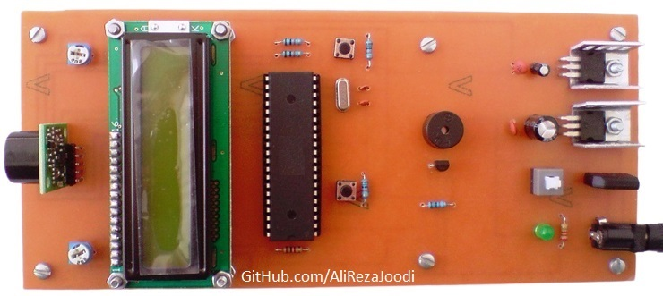
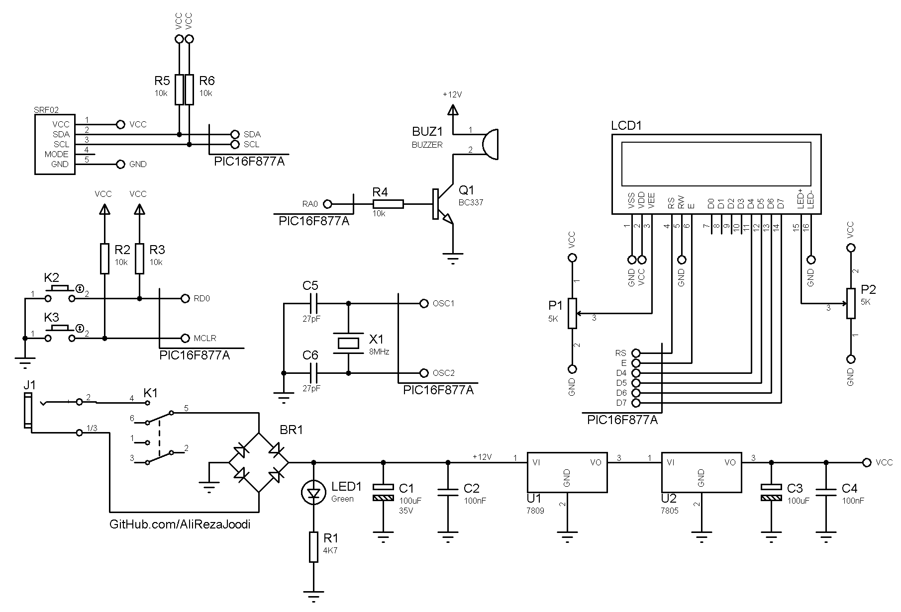

## Digital Meter using SRF02 Ultrasonic Moudle
	   
MCU:		PIC16F877A   
Frequency:     	8MHz (External Crystal)   
Display:        16x2 LCD   
Sensor:		SRF02 Ultrasonic Moudle (I2C Interfacing)     

Note: Included schematic and PCB layout with Proteus 

### Folder and Files Description
It has included:
- `Code_mikroC for PIC` (Code with C Language)
- `Hardware` (Included hardware layers)
- `Pictures` (Photos Samples Made)

### Pictures: v1.0

### Schematic: v1.0

My GitHub Account: [GitHub.com/AliRezaJoodi](https://github.com/AliRezaJoodi)  
**Note**: [You can go here to download a single folder or file from GitHub.com](https://minhaskamal.github.io/DownGit/#/home)
