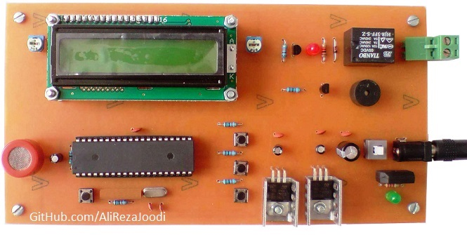
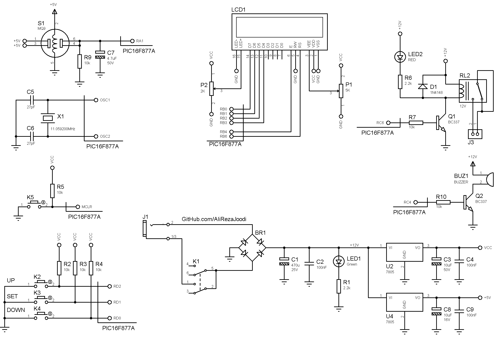
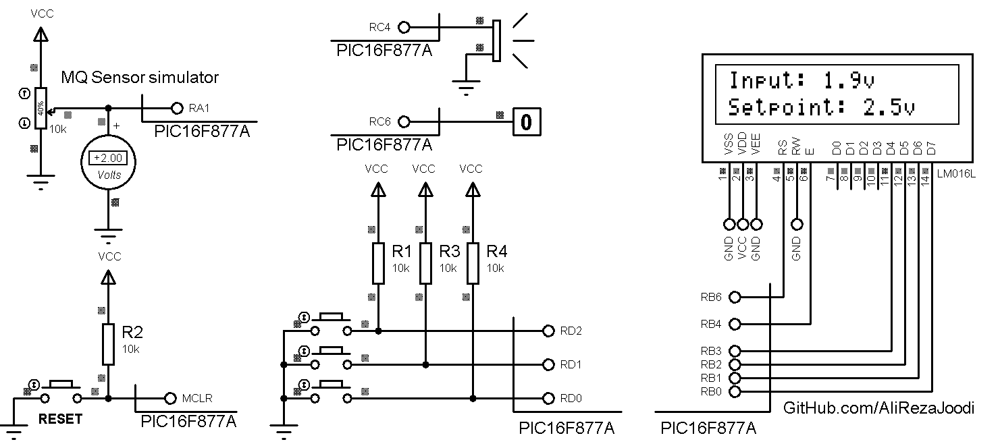

## Gas Leak Detector or Fire Alarm
It's usable for MQx Gas Sensors.  	   
MCU:		PIC16F877A  
Frequency:     	8MHz (External Crystal)   
Display:        16x2 LCD   

Note: Included schematic and PCB layout with Proteus  
Note: It's a prototype and should get better

### Folder and Files Description
It has included:
- `Code_mikroC for PIC` (Code with C Language)
- `Hardware` (Included hardware layers)
- `Pictures` (Photos Samples Made)
- `Simulate` (Simulator File)

### Pictures: v1.0

### Schematic: v1.0

### Simulate: v1.0

My GitHub Account: [GitHub.com/AliRezaJoodi](https://github.com/AliRezaJoodi)  
**Note**: [You can go here to download a single folder or file from GitHub.com](https://minhaskamal.github.io/DownGit/#/home)
