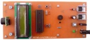
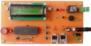
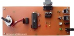
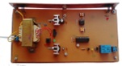
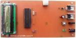
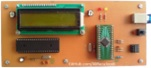

# PIC Microcontroller Projects 
Note: The projects are prototype and should get better. 

### Table of Contents
|Picture|Title|mikroC for PIC|PIC Basic PRO|
|:------|:----|:------------:|:-----------:|
||[Digital Meter With SRF02 Ultrasonic Moudle](DigitalMeter_Ultrasonic_SRF02)|Y|-|
||[Gas Leak Detector Or Fire Alarm](GasDetector)|Y|-|
||[Unipolar Step Motor Controller With A Computer (RS232)](MotorDriver_UnipolarStepperMotor_RS232)|Y|Y|
||[1CH Relay Controller With Laser Pointer](RelayController_LaserPointer_1CH)|-|Y|
||[Tel Card Reader](TelCardReader)|Y|-|
||[Text Control on the LCD With PS2 Keyboard](TextDisplay_Keyboard)|Y|-|
||[Text Control On LCD With Computer (USB)](TextDisplay_USB)|Y|Y|
