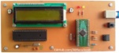

# PIC Microcontroller Projects
I'm uploading my personal projects on the repository.

### Gallery of the Repository

### List of the Repository
|Title|mikroC for PIC|PIC Basic PRO|
|:----|:------------:|:-----------:|
|[DigitalMeter_Ultrasonic_SRF02](DigitalMeter_Ultrasonic_SRF02)|Y|-|
|[GasDetector](GasDetector)|Y|-|
|[MotorDriver_UnipolarStepperMotor_RS232](MotorDriver_UnipolarStepperMotor_RS232)|Y|Y|
|[RelayController_LaserPointer_1CH](RelayController_LaserPointer_1CH)|-|Y|
|[TelCardReader](TelCardReader)|Y|-|
|[TextDisplay_LCD_PS2Keybord](TextDisplay_LCD_PS2Keybord)|Y|-|
|[TextDisplay_LCD_USB](TextDisplay_LCD_USB)|Y|Y|