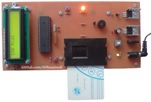

# PIC Microcontroller Projects 
Note: The projects are prototype and should get better. 

### Table of Contents
|Picture|Title|mikroC for PIC|PIC Basic PRO|
|:------|:----|:------------:|:-----------:|
|			|[Digital Meter With SRF02 Ultrasonic Moudle](DigitalMeter_Ultrasonic_SRF02)					|Y|-|
|					|[Gas Leak Detector Or Fire Alarm](GasDetector)									|Y|-|
|		|[Unipolar Step Motor Controller With A Computer (RS232)](MotorDriver_UnipolarStepperMotor_RS232)		|Y|Y|
|		|[1CH Relay Controller With Laser Pointer](RelayController_LaserPointer_1CH)					|-|Y|
|					|[Tel Card Reader](TelCardReader)										|Y|-|
|	|[Text Display With 16*2 LCD and Controlled By Computer](TextDisplayWithLCD16x2_ControlledByComputer)		|Y|Y|
|	|[Text Display With 16*2 LCD and Controlled By PC Keyboard](TextDisplayWithLCD16x2_ControlledByPcKeyboard)	|Y|-|

