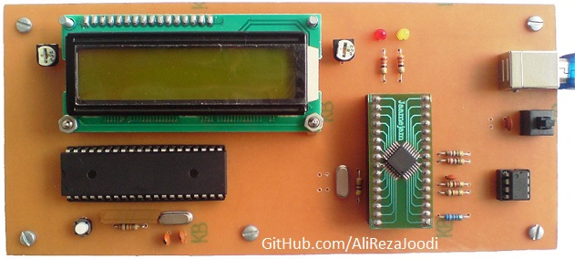
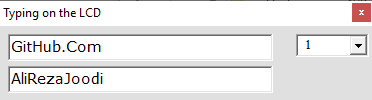
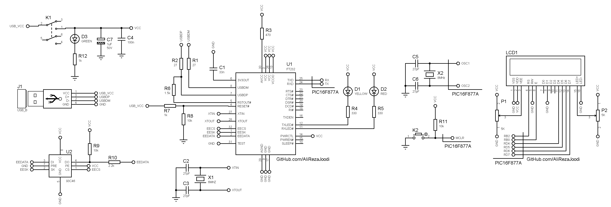

## Text Control on the LCD with a computer
Frame format is
|Line Command|Text|End Chr|Description|
|:-----------|:---|:------|:----------|
|'A'|"Hello World"|13|Display `Hello World` on the first line|
|'B'|"Hello World"|13|Display `Hello World` on the second line|
	   
MCU:			PIC16F877A  
Frequency:     		8MHz (External Crystal)   
Display:        	16x2 LCD        
Computer Interfacing:	UART to USB Converter  
Computer Software:	VB6	

Note: Included schematic and PCB layout with Proteus  
Note: It's a prototype and should get better

### Folder and Files Description
It has included:
- `Code_mikroC for PIC` (Code with C Language)
- `PIC Basic PRO` (Code with Basic Language)
- `Code_VB6` (Software with Visual Basic)
- `Hardware` (Included hardware layers)

### Pictures: v1.0

### Software: v1.0

### Schematic: v1.0

My GitHub Account: [GitHub.com/AliRezaJoodi](https://github.com/AliRezaJoodi)  
**Note**: [You can go here to download a single folder or file from GitHub.com](https://minhaskamal.github.io/DownGit/#/home)
